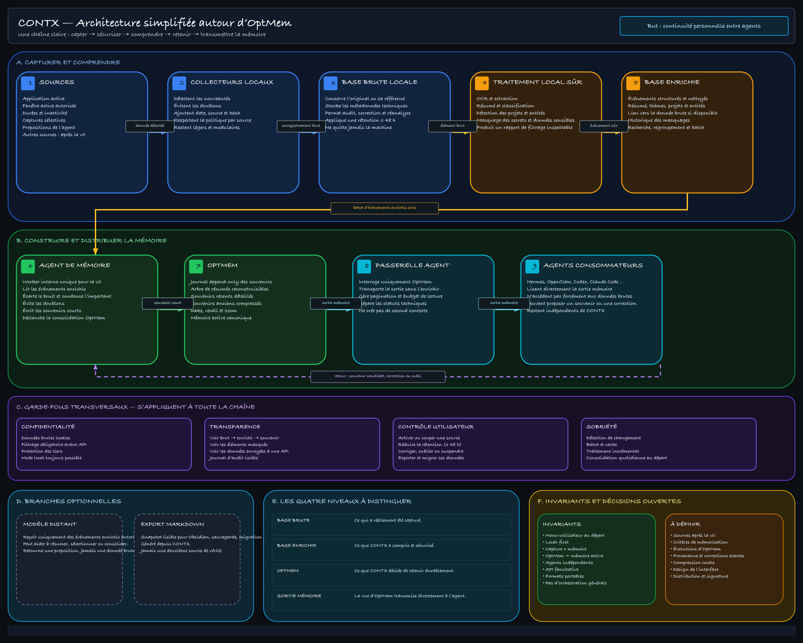

# CONTX

**A personal, local-first, open-source infrastructure that selectively observes your Mac activity to automatically build the working memory of your personal agent.**

CONTX turns diffuse digital traces (active app, active window, durations, selective screenshots) into a compact, useful, evolving memory. Raw observations are filtered and secured locally, structured into events, patterns and inferences, distilled into memory candidates, then stored through a `MemoryStore` interface backed by [OptMem](./optmem/). The memory output **is** the context handed to the agent — there is no separate Context Builder.

> CONTX est une infrastructure personnelle, local-first et open source qui observe de manière sélective l’activité d’un utilisateur sur son Mac afin de construire automatiquement la mémoire de travail de son agent personnel. ([cahier des charges, §36](./cahier_des_charges.md))

---

## Why

Personal agents only know what you explicitly tell them. They are nearly blind to your real digital life: what you actually work on, which projects resume or fade, how your attention shifts, what blocks you outside of conversations with them.

CONTX gives an agent a more continuous, situated, current understanding of you — by observing your activity **between** your explicit interactions with it.

It targets three behaviors:

- **Project resumption** — pick up a recent project without re-explaining everything.
- **Recent-period understanding** — explain what mainly occupied your last few days.
- **Change detection** — notice a resumed project, an apparent abandonment, a new habit.

---

## Architecture

The diagram below is a faithful Mermaid rendering of the reference schema in [`docs/architecture/CONTX_architecture_OptMem_final.excalidraw`](./docs/architecture/CONTX_architecture_OptMem_final.excalidraw). Open that file in [excalidraw.com](https://excalidraw.com) for the original hand-laid version.



<details>
<summary>Editable source</summary>

The schema above is rendered from the Excalidraw source: [`docs/architecture/CONTX_architecture_OptMem_final.excalidraw`](./docs/architecture/CONTX_architecture_OptMem_final.excalidraw) — open it in [excalidraw.com](https://excalidraw.com) to edit.

</details>

### What each stage does

| # | Stage | Role |
|---|-------|------|
| 1 | **Sources** | v0 observes active application/window metadata, durations, idle state, selective screenshots, and agent proposals. Mail, messages, calendar, location, and personal photos are post-v0 scope. |
| 2 | **Collecteurs locaux** | Detect novelties, avoid duplicates, add date/source/hash, respect per-source policy, stay light and modular. |
| 3 | **Base brute locale** | Keep the original or its reference, store technical metadata, allow audit/correction/re-analysis, enforce a configurable retention capped at 48 hours, never leaves the machine. |
| 4 | **Traitement local sûr** | OCR & extraction, summary & classification, project/entity detection, secret & sensitive-data redaction, produces an inspectable filtering report. |
| 5 | **Base enrichie** | Structured clean events, summary/themes/projects/entities, link back to raw data, redaction history, search/grouping/batch. |
| 6 | **Agent de mémoire** | Single internal worker for v0: reads enriched events, discards noise, condenses what matters, avoids duplicates, writes short memories, triggers OptMem consolidation. |
| 7 | **OptMem** | Append-only memory log, rebuildable summary tree, detailed recent / compressed old memories, `wake`/`recall`/`zoom`, the canonical active memory. |
| 8 | **Passerelle agent** | Invokes OptMem, transports and paginates its output, and reports technical status separately. It never adds a second semantic context source. |
| 9 | **Agents consommateurs** | Hermes, OpenClaw, Codex, Claude Code… read the memory output directly, don’t necessarily access raw data, can propose a memory or correction, stay independent of CONTX. |

### Transversal guardrails

- **Confidentialité** — raw data stays local; filtering required before any API; third-party protection; local mode always possible.
- **Transparence** — see raw → enriched → memory; see masked items; see data sent to an API; readable audit log.
- **Contrôle utilisateur** — enable/disable a source; shorten retention below the 48-hour maximum; correct, forget or suspend; export and migrate your data.
- **Sobriété** — change detection, batch & cache, incremental processing, daily consolidation to start.

### Four objects not to confuse

| Object | Meaning |
|--------|---------|
| **Base brute** | What was actually captured. |
| **Base enrichie** | What CONTX understood and secured. |
| **OptMem** | What CONTX decides to retain durably. |
| **Sortie mémoire** | The budgeted OptMem view transported directly to the agent without semantic enrichment. |

### Optional branches

- **Modèle distant** — receives only authorized enriched events; may help summarize/select/consolidate; returns a proposal, never raw data. Off by default.
- **Export Markdown** — a readable snapshot for Obsidian, backup, migration or an incompatible agent. Generated from CONTX. Never a second source of truth.

---

## Key invariants

The full list is in [§4 of the spec](./cahier_des_charges.md). The load-bearing ones:

- **Single user, local-first, fully offline-capable.** Raw data never leaves the Mac.
- **Raw data deleted within 48 h of capture.** Every raw record carries `expires_at`; a logged purge runs regularly and at startup.
- **Remote model calls are optional, disabled by default, and inspectable.** Raw data is never sent remotely.
- **An observation never becomes a memory directly.** Observation → event → pattern/inference → candidate → stored memory are distinct stages.
- **Agent proposals go through CONTX validation** before the `MemoryStore`; the agent never owns the memory; subagents never write to it.
- **OptMem is the final context layer.** No separate Context Builder in v0.
- **The user can pause collection instantly** and exclude apps/windows; the collector never screenshots blindly at a fixed cadence.
- **Modular monolith.** Every replaceable component sits behind a stable interface.
- **Quality over quantity.** CONTX never becomes an agent orchestrator and never executes the user's personal actions.

---

## Pipeline

```text
Mac activity
    ↓
Raw observations          (active app, active window, durations, selective screenshots)
    ↓
Local filtering & security (OCR, secret detection, redaction, classification)
    ↓
Structured events         (period, projects, entities, confidence, provenance)
    ↓
Patterns & inferences     (recurrences, trends, changes — never from a single event)
    ↓
Memory candidates         (scored, deduplicated, fused, deferred if fragile)
    ↓
Memory worker             (accepts / rejects / merges / corrects)
    ↓
MemoryStore (OptMem)      (append-only log + rebuildable summary tree)
    ↓
Context delivered to the agent  (wake, recall, zoom — directly, no Context Builder)
```

The agent reaches CONTX through a small CLI:

```text
contx wake                 # get the final memory context
contx recall <query>       # search the memory
contx zoom <node>          # navigate the summary tree
contx propose "<memory>"   # propose a memory (goes through validation, not direct write)
contx correct <id> "<fix>" # correct an existing memory
contx status              # collection state
contx pause / resume       # instant pause / resume
```

---

## Roadmap

| Version | Milestone | Goal |
|---------|-----------|------|
| **v0.0.1** | **J0 + vertical slice** | Repo, ADRs, schemas, migrations, minimal CLI, and one end-to-end `active app → wake` path. |
| **v0.1** | **J1 macOS collection** | Active app/window, durations, idle detection, selective captures, exclusions, raw store, purge. |
| **v0.2** | **J2 local privacy** | Local OCR, secret detection, redaction, sensitivity levels, transformation audit. |
| **v0.3** | **J3 events** | Sessionisation, structured events, entities, projects, provenance, confidence. |
| **v0.4** | **J4 patterns & candidates** | Repetition detection, temporal comparison, candidates, scoring, dedup, worker decisions. |
| **v0.5** | **J5 memory & agent** | `MemoryStore`, complete OptMem lifecycle, `wake`/`recall`/`zoom`, proposals, corrections, Codex integration. |
| **v0.6** | **J6 web UI** | Dashboard, activity, patterns, memory, privacy, settings, wake preview. |
| **v0.9** | **J7 real pilot** | 7–14 day pilot, ground truth, with/without CONTX comparison, error analysis, OptMem decision. |
| **v1.0** | **J8 hardening** | Fixes, optimization, install/upgrade/uninstall, recovery, distribution, licensing, and documentation. |

**Active goal:** complete the Phase 0 decision baseline, then deliver v0.0.1 — `active app → local observation → simple event → memory candidate → OptMem → contx wake` — before OCR, complex patterns, a daemon, or any web UI (§37 and the [implementation plan](./docs/implementation-plan.md)).

---

## Current state

Greenfield. The repository contains the specification, working agreement, implementation plan, initial ADRs, architecture assets, and an ignored local reference clone of OptMem (`optmem/`). No CONTX product code has been written yet.

---

## Tech stack (reference, §22)

- **Python 3.12** via [uv](https://docs.astral.sh/uv/), Pydantic schemas, SQLite (WAL), SQLAlchemy 2, Alembic, Typer CLI, FastAPI when the local API has a consumer, pytest.
- **macOS:** PyObjC (NSWorkspace, Accessibility API, ScreenCaptureKit/CoreGraphics), background launch via `launchd`.
- **OCR** behind a replaceable interface; Apple Vision is the first candidate `[HYPOTHÈSE]`.
- **Models** behind a `ModelProvider` interface; deterministic rules with no model are a valid backend.
- **Web UI (J6):** React + Vite + TypeScript SPA, bound to `127.0.0.1` only.

Once the scaffold exists:

```sh
uv sync          # create venv, install dependencies
uv run pytest    # run the test suite
uv run contx --help
```

---

## Repository layout

```text
contx/
├── cahier_des_charges.md          # source of truth (French, normative)
├── AGENTS.md                      # working agreement for agents
├── optmem/                        # local reference clone — ignored and untracked
├── docs/architecture/             # architecture diagrams (Excalidraw source)
├── pyproject.toml
├── apps/{api,cli,web}/
├── contx/                         # the Python package
│   ├── collectors/  raw_store/  privacy/  processing/
│   ├── events/  patterns/  candidates/  memory_worker/
│   ├── memory_store/  agent_gateway/  audit/
│   ├── models/  settings/  db/
├── migrations/  tests/  fixtures/  scripts/
└── docs/{architecture,adr,evaluation,threat-model}/
```

Runtime data lives **outside the repo**. Durable state uses `~/Library/Application Support/CONTX/`, temporary raw data uses `~/Library/Caches/CONTX/`, and logs use `~/Library/Logs/CONTX/`. Private directories and files use restrictive local-user permissions.

---

## References

- [`cahier_des_charges.md`](./cahier_des_charges.md) — normative specification (French): data model §21, local API §24, performance §27, quality thresholds §28.7, acceptance §33.
- [`AGENTS.md`](./AGENTS.md) — working agreement, invariants, roadmap, repo rules.
- [`docs/implementation-plan.md`](./docs/implementation-plan.md) — executable delivery plan, gates, tests, and release mapping.
- [`docs/adr/`](./docs/adr/) — accepted architecture and product decisions.
- [`docs/third-party/optmem.md`](./docs/third-party/optmem.md) — OptMem provenance and redistribution gate.
- [`optmem/README.md`](./optmem/README.md) — OptMem contract: `wake`, `note`, `nap`, `recall <regex>`, `zoom <lo>-<hi>`, `forget`.
- [`docs/architecture/CONTX_architecture_OptMem_final.excalidraw`](./docs/architecture/CONTX_architecture_OptMem_final.excalidraw) — original architecture schema (open in [excalidraw.com](https://excalidraw.com)).

---

*CONTX is personal, local-first and open source. It does not record every action, does not produce an exhaustive journal of your day, and does not become a surveillance system, an agent orchestrator, or a general memory of your whole life.*
