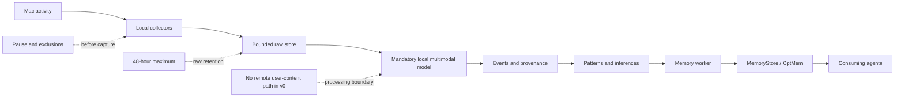

# CONTX

**A personal, local-first, open-source infrastructure that selectively observes your Mac activity to automatically build the working memory of your personal agent.**

CONTX turns diffuse digital traces (active app, active window, durations, selective screenshots) into a compact, useful, evolving memory. Raw observations are interpreted by a mandatory local multimodal model, structured into events, patterns and inferences, distilled into memory candidates, then stored through a `MemoryStore` interface backed initially by [OptMem](./docs/third-party/optmem.md). The memory output **is** the context handed to the agent — there is no separate Context Builder.

> CONTX est une infrastructure personnelle, local-first et open source qui observe de manière sélective l’activité d’un utilisateur sur son Mac afin de construire automatiquement la mémoire de travail de son agent personnel. ([cahier des charges, §36](./cahier_des_charges.md))

---

## Why

Personal agents only know what you explicitly tell them. They are nearly blind to your real digital life: what you actually work on, which projects resume or fade, how your attention shifts, what blocks you outside of conversations with them.

CONTX gives an agent a more continuous, situated, current understanding of you — by observing your activity **between** your explicit interactions with it.

It targets three behaviors:

- **Project resumption** — pick up a recent project without re-explaining everything.
- **Recent-period understanding** — explain what mainly occupied your last few days.
- **Change detection** — notice a resumed project, an apparent abandonment, a new habit.

---

## Architecture



The detailed hand-laid architecture remains editable in
[`docs/architecture/CONTX_architecture_OptMem_final.excalidraw`](./docs/architecture/CONTX_architecture_OptMem_final.excalidraw).
Open it in [excalidraw.com](https://excalidraw.com) to edit. The older PNG is a
non-normative snapshot; the specification, ADRs, Mermaid diagram, and editable
Excalidraw source are authoritative.

### What each stage does

| # | Stage | Role |
|---|-------|------|
| 1 | **Sources** | v0 observes active application/window metadata, durations, idle state, selective screenshots, and agent proposals. Mail, messages, calendar, location, and personal photos are post-v0 scope. |
| 2 | **Collecteurs locaux** | Detect novelties, avoid duplicates, add date/source/hash, respect per-source policy, stay light and modular. |
| 3 | **Base brute locale** | Keep the original or its reference, store technical metadata, allow audit/correction/re-analysis, enforce a configurable retention capped at 48 hours, never leaves the machine. |
| 4 | **Interprétation locale** | A mandatory local multimodal model interprets permitted screenshots and metadata, returns schema-validated summaries/classifications/projects/entities/sensitivity, and records inspectable provenance. |
| 5 | **Base enrichie** | Structured events, summaries/themes/projects/entities, links back to raw evidence, model-transformation history, search/grouping/batch. |
| 6 | **Agent de mémoire** | Single internal worker for v0: reads enriched events, discards noise, condenses what matters, avoids duplicates, writes short memories, triggers OptMem consolidation. |
| 7 | **OptMem** | Append-only memory log, rebuildable summary tree, detailed recent / compressed old memories, `wake`/`recall`/`zoom`, the canonical active memory. |
| 8 | **Passerelle agent** | Invokes OptMem, transports and paginates its output, and reports technical status separately. It never adds a second semantic context source. |
| 9 | **Agents consommateurs** | Hermes, OpenClaw, Codex, Claude Code… read the memory output directly, don’t necessarily access raw data, can propose a memory or correction, stay independent of CONTX. |

### Transversal guardrails

- **Confidentialité** — raw data and user content stay on the Mac; v0 has no remote model provider or outbound user-content transport; local processing is mandatory.
- **Transparence** — see raw → local-model transformation → enriched → memory, including model/prompt/schema versions and a readable audit log.
- **Contrôle utilisateur** — enable/disable a source; shorten retention below the 48-hour maximum; correct, forget or suspend; export and migrate your data.
- **Sobriété** — change detection, batch & cache, incremental processing, daily consolidation to start.

### Four objects not to confuse

| Object | Meaning |
|--------|---------|
| **Base brute** | What was actually captured. |
| **Base enrichie** | What CONTX understood and secured. |
| **OptMem** | What CONTX decides to retain durably. |
| **Sortie mémoire** | The budgeted OptMem view transported directly to the agent without semantic enrichment. |

### Optional branches

- **Export Markdown** — a readable snapshot for Obsidian, backup, migration or an incompatible agent. Generated from CONTX. Never a second source of truth.

A remote model is not a v0 branch. Adding one later would require a new product
decision, ADR, and security boundary before any user content could leave the
Mac.

---

## Key invariants

The full list is in [§4 of the spec](./cahier_des_charges.md). The load-bearing ones:

- **Single user, local-first, fully offline-capable.** Raw data and model inputs/outputs never leave the Mac.
- **Raw data deleted within 48 h of capture.** Every raw record carries `expires_at`; a logged purge runs regularly and at startup.
- **A local multimodal model is mandatory for v0 semantic processing.** There is no deterministic production fallback and no remote provider.
- **An observation never becomes a memory directly.** Observation → event → pattern/inference → candidate → stored memory are distinct stages.
- **Agent proposals go through CONTX validation** before the `MemoryStore`; the agent never owns the memory; subagents never write to it.
- **OptMem is the final context layer.** No separate Context Builder in v0.
- **The user can pause collection instantly** and exclude apps/windows; the collector never screenshots blindly at a fixed cadence.
- **Modular monolith.** Every replaceable component sits behind a stable interface.
- **Quality over quantity.** CONTX never becomes an agent orchestrator and never executes the user's personal actions.

---

## Pipeline

```text
Mac activity
    ↓
Raw observations          (active app, active window, durations, selective screenshots)
    ↓
Local multimodal model    (interpretation, classification, sensitivity, provenance)
    ↓
Structured events         (period, projects, entities, confidence, provenance)
    ↓
Patterns & inferences     (recurrences, trends, changes — never from a single event)
    ↓
Memory candidates         (scored, deduplicated, fused, deferred if fragile)
    ↓
Memory worker             (accepts / rejects / merges / corrects)
    ↓
MemoryStore (OptMem)      (append-only log + rebuildable summary tree)
    ↓
Context delivered to the agent  (wake, recall, zoom — directly, no Context Builder)
```

The implemented v0.0.1 CLI surface is:

```text
contx init                              # initialize paths and database, collection off
contx status                            # inspect initialization and safe defaults
contx capabilities                      # inspect collection permissions without prompting
contx pause --for 15m                   # stop collection through persisted control state
contx resume                            # resume collection explicitly
contx run-once --source synthetic       # deterministic end-to-end proof
contx run-once --source active-app      # one explicit macOS metadata sample
contx model status                      # content-free local runtime/model preflight
contx process                           # process one bounded local-model backlog batch
contx timeline build --from <iso> --until <iso> # replay a frozen activity window
contx timeline show <processing-run-id> # inspect one selected timeline snapshot
contx timeline correct <event-id> --summary <text> --reason <text>
contx wake                              # direct final-memory context
contx recall '<regex>'                  # historical raw-memory search
contx zoom <node>                       # historical tree navigation
contx memory maintain                   # bounded local-model compression
contx propose '<memory>' --reference-type <type> --reference <uuid>
contx correct <memory-uuid> '<replacement>'
```

Installed continuous collection is not activated. `wake` is chronological: a
newer `Correction:` line is authoritative over the older claim it contradicts.
`recall` and `zoom` deliberately retain historical behavior. Agent proposals
remain outside final memory, and `correct` requires an explicit user
instruction.

---

## Roadmap

| Version | Milestone | Goal |
|---------|-----------|------|
| **v0.0.1** | **J0 + vertical slice** | Repo, ADRs, schemas, migrations, minimal CLI, and one end-to-end `active app → wake` path. |
| **v0.1** | **J1 macOS collection** | Active app/window, durations, idle detection, selective captures, exclusions, raw store, purge. |
| **v0.2** | **J2 local model** | Mandatory local multimodal model, strict structured output, sensitivity levels, and transformation audit. |
| **v0.3** | **J3 events** | Sessionisation, structured events, entities, projects, provenance, confidence. |
| **v0.4** | **J4 patterns & candidates** | Repetition detection, temporal comparison, candidates, scoring, dedup, worker decisions. |
| **v0.5** | **J5 memory & agent** | `MemoryStore`, complete OptMem lifecycle, `wake`/`recall`/`zoom`, proposals, corrections, Codex integration. |
| **v0.6** | **J6 web UI** | Dashboard, activity, patterns, memory, privacy, settings, wake preview. |
| **v0.9** | **J7 real pilot** | 7–14 day pilot, ground truth, with/without CONTX comparison, error analysis, OptMem decision. |
| **v1.0** | **J8 hardening** | Fixes, optimization, install/upgrade/uninstall, recovery, distribution, licensing, and documentation. |

**Active goal:** complete v0.5 memory and agent integration while keeping the
real v0.1 collector activation separately gated, then continue through the
local UI and the explicitly approved v0 pilot (§37 and the
[implementation plan](./docs/implementation-plan.md)).

---

## Current state

v0.0.1 is implemented and verified. It includes:

- a reproducible Python 3.12 package and locked environment;
- private native macOS runtime paths and strict configuration;
- an Alembic-managed SQLite WAL database;
- strict `Observation`, `Event`, `MemoryCandidate`, `MemoryLink`, and
  `ProcessingRun` contracts with queryable provenance;
- a deterministic project-resumption pipeline and a conservative rejection
  path;
- explicit one-shot active-application collection with no window title,
  screenshot, OCR artifact, network call, or background process;
- a typed `MemoryStore`, a checksum-pinned isolated OptMem adapter, append
  recovery, and direct `contx wake` output.

The active-app collector may report that no frontmost application is available
in a headless or restricted host session. The in-progress v0.1 foundation now
adds database-backed pause and exclusions, bounded raw artifacts and
restart-safe purge, duration and system-state segmentation, non-prompting
permission preflights, optional privacy-gated window titles, selective and
exactly deduplicated screenshots, a minimal AppKit menu, an audited
single-process daemon, graceful shutdown, and a deterministic LaunchAgent
manifest. The daemon remains disabled by default; no LaunchAgent, live title
access, live screenshot capture, or real-data pilot has been activated.

The completed v0.2 foundation adds mandatory local-model settings, a
literal-loopback-only Ollama transport, a strict multimodal interpretation
schema, model/prompt/schema/source and latency provenance, a content-free
preflight command, a restart-safe version-scoped processing queue, persisted
transformation/run provenance, bounded retry and interruption recovery,
content-free backlog status, and synthetic visual and full-pipeline validators.
The v0 default is `gemma4:e4b-it-qat`; model files live in Ollama's external
local store and are never committed. With thinking disabled, a 512-token output
bound, prompt `local-screen-v9`, and the full synthetic image profile, the
selected model passed all 16 fixed privacy and quality fixtures and the
persistent model-to-event proof. `contx process` processes one bounded backlog
batch without collecting new data, then builds deterministic events with
foreign-key-backed transformation and processing-run provenance. The hard
durable-memory gate rejects `sensitive` and `forbidden` content. Protected-value
reproduction is measured locally but is not a masking gate; v0 has no
deterministic extraction or redaction path and no remote user-content path.

The completed v0.3 foundation adds a bounded event vocabulary, configurable
sessionization, explicit validity, evidence lineage, processing-run timeline
snapshots, same- and changed-version replay, and append-only event corrections.
A frozen synthetic day produces an intelligible two-event timeline; a correction
survives a compatible v2 rebuild without mutating v1 evidence. `contx timeline`
can build, show, and correct explicit snapshots without collecting or invoking
the model.

The completed v0.4 foundation adds immutable pattern snapshots, project
recurrence and resumption, temporal changes, fused memory candidates,
transparent acceptance decisions, and side-by-side rule and threshold replay.
The in-progress v0.5 foundation promotes accepted candidates with transitive
provenance, performs bounded local-model OptMem compression, exposes direct
`wake`/`recall`/`zoom`, isolates agent proposals, and supports restart-safe
append-only corrections. ADR 0013 selects explicit `Correction:` entries with
SQLite sidecar status and provenance for v0; an active-only projection remains
the evidence-triggered fallback.

The local web UI and real pilot belong to the following increments. OptMem is
used from an ignored development snapshot; it is not bundled while
redistributable rights remain undocumented. See
[`docs/evaluation/v0.1-preflight.md`](docs/evaluation/v0.1-preflight.md) for the
current J1 evidence and remaining gates, and
[`docs/evaluation/v0.2-local-model-preflight.md`](docs/evaluation/v0.2-local-model-preflight.md)
for the complete J2 model evidence and residual risks, and
[`docs/evaluation/v0.3-activity-timeline-validation.md`](docs/evaluation/v0.3-activity-timeline-validation.md)
for the J3 replay and correction proof,
[`docs/evaluation/v0.4-pattern-candidate-validation.md`](docs/evaluation/v0.4-pattern-candidate-validation.md)
for the J4 decision replay, and
[`docs/evaluation/v0.5-memory-correction-validation.md`](docs/evaluation/v0.5-memory-correction-validation.md)
for the current J5 OptMem correction evidence.

---

## Tech stack (reference, §22)

- **Python 3.12** via [uv](https://docs.astral.sh/uv/), Pydantic schemas, SQLite (WAL), SQLAlchemy 2, Alembic, Typer CLI, FastAPI when the local API has a consumer, pytest.
- **macOS:** PyObjC (NSWorkspace, Accessibility API, ScreenCaptureKit/CoreGraphics), background launch via `launchd`.
- **Local models** behind a typed `ModelProvider` interface; v0 requires a local multimodal backend and schema-validates every result.
- **OCR** may later be evaluated as a local optimization, but is not a required production path or semantic fallback.
- **Web UI (J6):** React + Vite + TypeScript SPA, bound to `127.0.0.1` only.

Development setup:

```sh
uv sync --locked # create the Python 3.12 environment from uv.lock
uv run pytest -q # run the test suite
uv run contx --help
uv run contx init
uv run contx model status
uv run contx run-once --source synthetic
uv run contx wake
```

The last two commands require the reviewed OptMem executable. A development
checkout is resolved from `optmem/memo`; an installed copy can be selected with
an absolute `CONTX_OPTMEM_EXECUTABLE` path. CONTX rejects a file whose SHA-256
does not match the recorded snapshot instead of running unreviewed code.

---

## Repository layout

```text
contx/
├── cahier_des_charges.md          # source of truth (French, normative)
├── AGENTS.md                      # working agreement for agents
├── optmem/                        # local reference clone — ignored and untracked
├── docs/architecture/             # architecture diagrams (Excalidraw source)
├── pyproject.toml
├── contx/                         # the Python package
│   ├── application/  cli/  collectors/
│   ├── events/  candidates/  memory_worker/  memory_store/
│   ├── models/  settings/  db/
│   └── db/migrations/
├── tests/{unit,integration}/
└── docs/{architecture,adr,evaluation}/
```

Runtime data lives **outside the repo**. Durable state uses `~/Library/Application Support/CONTX/`, temporary raw data uses `~/Library/Caches/CONTX/`, and logs use `~/Library/Logs/CONTX/`. Private directories and files use restrictive local-user permissions.

---

## References

- [`cahier_des_charges.md`](./cahier_des_charges.md) — normative specification (French): data model §21, local API §24, performance §27, quality thresholds §28.7, acceptance §33.
- [`AGENTS.md`](./AGENTS.md) — working agreement, invariants, roadmap, repo rules.
- [`docs/implementation-plan.md`](./docs/implementation-plan.md) — executable delivery plan, gates, tests, and release mapping.
- [`docs/adr/`](./docs/adr/) — accepted architecture and product decisions.
- [`docs/dependencies.md`](./docs/dependencies.md) — dependency rationale, licensing, transitive cost, and exit strategy.
- [`docs/third-party/optmem.md`](./docs/third-party/optmem.md) — OptMem provenance and redistribution gate.
- `optmem/README.md` in a local development checkout — upstream OptMem
  contract; the ignored snapshot is intentionally absent from CONTX release
  artifacts.
- [`docs/architecture/CONTX_architecture_OptMem_final.excalidraw`](./docs/architecture/CONTX_architecture_OptMem_final.excalidraw) — original architecture schema (open in [excalidraw.com](https://excalidraw.com)).

---

*CONTX is personal, local-first and open source. It does not record every action, does not produce an exhaustive journal of your day, and does not become a surveillance system, an agent orchestrator, or a general memory of your whole life.*
